# SurveilX-Edge engineering specification

The paper (Phase 11) is excluded. This repository separates executable prototype capabilities from experiments that require real data and target devices. Actual training results are recorded in run manifests and the [detection benchmark](detection-benchmark.md). The architecture itself implies no calibrated threat estimator, novelty claim or measured energy saving.

## Decisions from prior art

Chameleon already adapts model configuration; Reducto already filters redundant video; calibration and selective prediction already exist. RAIC is therefore an engineering controller, not a new algorithm claim. An untrained reinforcement learner would be inappropriate for cold start. Use a measured-cost constrained allocator with explicit coverage deadlines first. Maintain one scheduler, one calibration implementation, one track memory, and one incident state machine.

| Module | Purpose and input → output | Timescale / cost | Learned parameters and training | Independence |
|---|---|---|---|---|
| Ingestion | Camera source → latest frame, health | Capture rate; bounded frame slot | None | Owns reconnect and backpressure |
| ASIE | Configured environment, zones, frame quality → versioned profile | Per frame cheap statistics; profile changes infrequent | No semantic classifier in cold start | Provides context; never schedules |
| RAIC | State and available expert profiles → feasible computation | Each allocation epoch; O(CA) | Measured latency; utility table awaits labeled replay | Builds action candidates |
| MCRS | Candidates and global budget → camera/action assignments | Each epoch; deadline-first greedy O(C log C + CA) | None | Sole execution arbiter |
| Detector | Frame and resolution → boxes and raw scores | Scheduled; measured | HOG baseline or supplied YOLO weights | Fast object evidence |
| SVA-Net | Clip, entity boxes, context → entity states, relations, event logits | Scheduled; tensor-dependent | Offline supervised multi-task prototype | Temporal reasoning lives here |
| Arbitration | Available calibrated evidence → accept/abstain/conflict | Per inference; O(number of outputs) | Held-out temperature | Combines evidence; never allocates |
| Risk/events | Observations, zones, persistence → reviewable incident | Per result | Configurable operational rules, not threat probabilities | Owns lifecycle and deduplication |
| Adaptation | Independently reviewed labels → versioned train-only evidence, replay and calibrated candidate models | Offline, opt-in approval-count trigger | Selected architecture retraining | Cannot replace production weights |
| Acceptance | Frozen candidate and independent data → metrics, policy decision and artifact-bound approval | Offline | No fitting on acceptance data | Separate approval, canary and promotion |

## Mathematical contract

At epoch t, camera i has observation vector s(i,t): motion fraction, mean brightness, latest observation age in seconds, last measured inference latency in milliseconds, configured priority, last operational risk severity, frame age, and expert availability. Hardware observation h(t) includes available RAM, CPU utilization, optional GPU telemetry, battery and temperature. Missing telemetry remains null.

Action a is an available expert and resolution, or DEFER. A cost profile c(i,a) is the conservative measured latency estimate; m(a) is estimated model memory. Budget B(t) is the inference wall-time allocation per epoch, adjusted by the power governor. Deadline d(i) is the configured maximum service gap. Utility v(i,a) must ultimately be estimated from held-out labeled data as expected avoided task loss; it is not a raw confidence score.

The intended allocation is maximize sum of v(i,a) x(i,a), subject to sum of c(i,a) x(i,a) ≤ B(t), sum over a of x(i,a) ≤ 1 per camera, availability and memory eligibility, and service deadlines where feasible. x is binary. This is a multiple-choice knapsack, not a claim of a novel CMDP solver. The implementation uses deadline-first ordering and best feasible configuration. Until utility is learned, it uses explicit operator priority and aging, labeled as a cold-start heuristic. Infeasible coverage is reported, never silently claimed satisfied.

Runtime is serial inference plus independent capture threads. A non-preemptible model invocation may exceed its estimate; measure the actual overrun and reduce the next allocation. Hard end-to-end latency and critical-event miss guarantees cannot be established from estimates alone. No convergence claim applies to this heuristic; bounded latest-frame queues prevent accumulation, while sustained offered load above capacity causes measured frame replacement and service deadline violations.

Power levels are **inference budgets**, not operating-system power-plan changes or wattage guarantees. Startup probes CPU/RAM and optional accelerators. The governor responds to measured load, thermal pressure and battery state with immediate reductions and slower recovery (hysteresis). CPU-only laptops/desktops are first-class. GPU use is permitted only if the selected runtime can actually execute there. A detected NVIDIA device alone is insufficient.

Temperature calibration uses p = softmax(z/T), where z is held-out model logits and positive T minimizes negative log likelihood. Brier score measures mean squared probability error. ECE is a bin-based diagnostic, not a safety guarantee. Calibration must be keyed to task, domain, model version and class taxonomy. No arithmetic averaging of incomparable detector and event scores is allowed. Abstain when calibration is absent or when comparable calibrated experts disagree beyond a validated threshold.

## Runtime flow

```mermaid
flowchart LR
  Cameras --> Capture[Bounded latest-frame capture]
  Capture --> State[ASIE and track memory]
  State --> RAIC[Feasible actions]
  Hardware[Hardware governor] --> RAIC
  RAIC --> MCRS[Global allocation]
  MCRS --> Expert[Available visual expert]
  Expert --> Arbitration[Calibration and abstention]
  Arbitration --> Events[Persistence and risk rules]
  Events --> Store[(Incidents and evidence)]
  Store --> UI[Operator dashboard]
  UI --> Feedback[Reviewed labels]
  Feedback --> Offline[Offline candidate training]
  Offline --> Registry[Validation and deployment gate]
```

## SVA-Net hypothesis

A small shared spatial encoder samples spatial entity features using supplied boxes for every clip frame. Temporal depthwise convolution preserves entity histories; pairwise relative geometry and entity embeddings form interaction messages. Context modulates entities through a learned affine adapter. Entity-state and interaction heads plus a pooled event head share representations. This is a custom research implementation assembled from established primitives, not proven architectural novelty. Box proposals come from an independent detector or labeled boxes; SVA-Net is not yet an independent object detector. Ablate motion, context, interactions and temporal convolution separately. Do not deploy random initialization as incident evidence.

The separate `training/detector_model.py` implements SVA-Detector from random initialization with multiscale box/class/objectness heads. It supplies a trainable detection stage alongside the event model. See [mathematical foundations](mathematical-foundations.md) for the implemented objectives and [dataset adapters](dataset-adapters.md) for supported supervision.

## Storage and service boundaries

Use a modular FastAPI process, SQLAlchemy and PostgreSQL for deployment; SQLite is an explicit local development fallback. Evidence is stored outside the database, with encrypted local objects or optional S3-compatible storage. Capture is concurrent; inference is globally serialized. Redis is unnecessary for one process. Multiple API replicas require external pub/sub, exclusive worker leases and distributed session/rate-limit storage before deployment.

Security: password hashing, opaque expiring sessions, HttpOnly cookies, role gates, encrypted camera source fields and evidence, audit trails, source restrictions, bounded request data and same-origin mutation protection. TLS termination, disk encryption, secret backups and storage IAM remain deployment responsibilities. No biometric identification is included.
