# System diagrams

These diagrams distinguish executable paths from research/deployment targets. The complete runtime overview is in [architecture.md](architecture.md).

## 1. Overall system

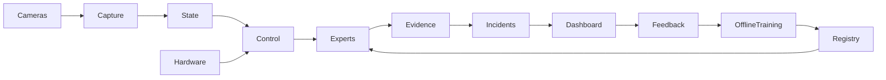

## 2. RAIC

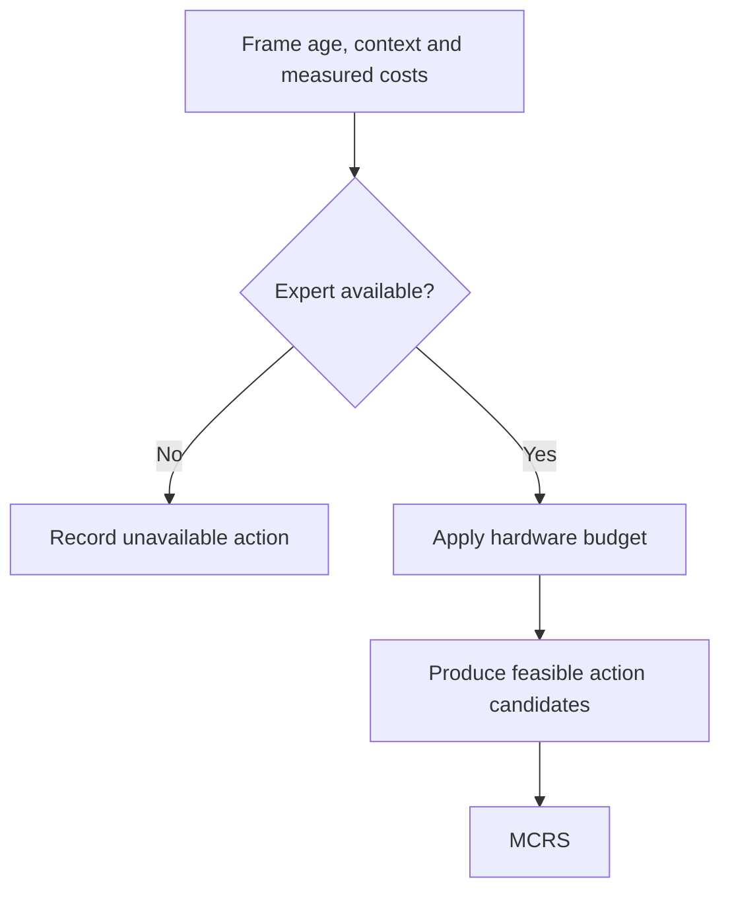

## 3. ASIE

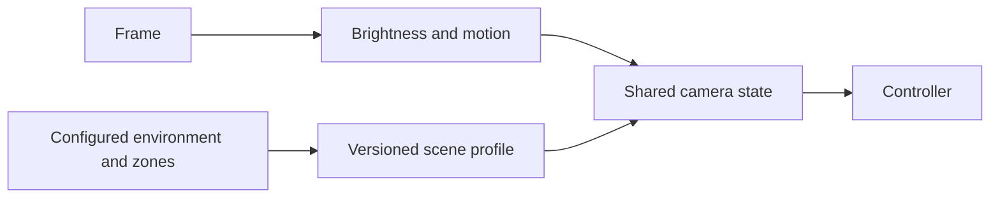

Automatic semantic scene classification is not implemented; the diagram accurately shows the manual-profile cold start.

## 4. YOLO-RAI research target

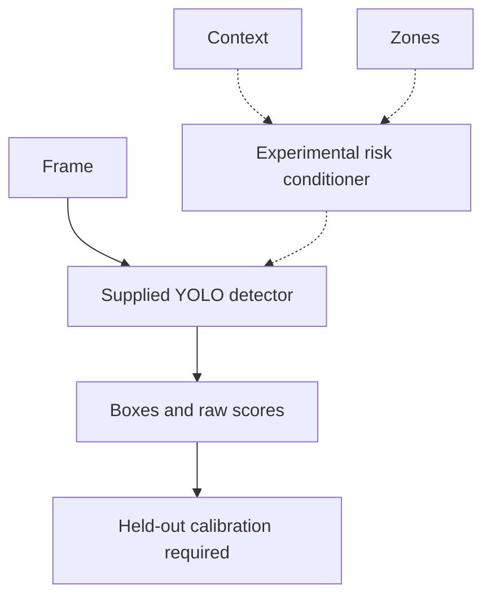

Dashed conditioning edges are not yet integrated/trained in a YOLO backbone.

## 5. SVA-Net

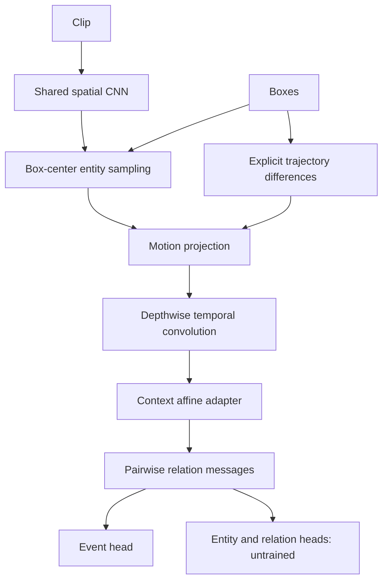

## 6. Arbitration

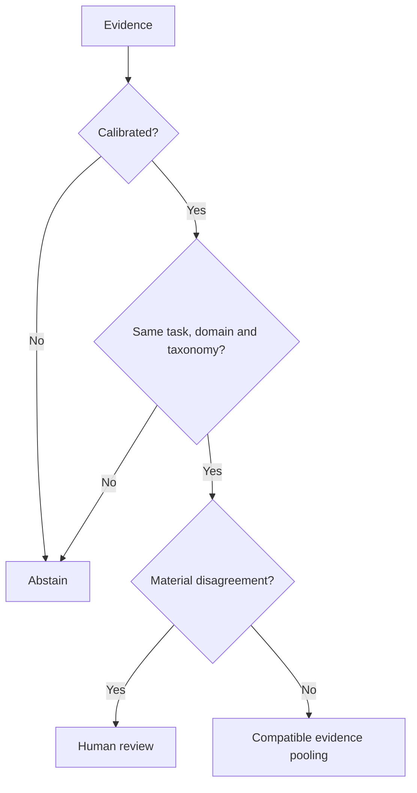

## 7. MCRS

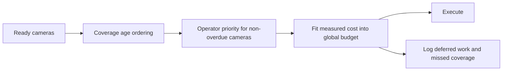

## 8. Incident lifecycle

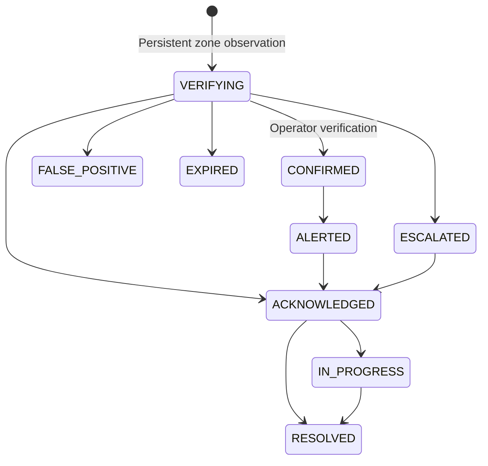

The full transition table in `surveilx/incidents.py` is authoritative. A delivered review notification does not automatically mean the event is confirmed.

## 9. Admin architecture

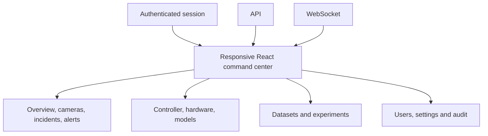

## 10. Notification architecture

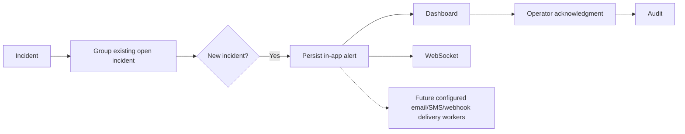

External delivery retries, recipient routing and escalation timers remain implementation work; no external messages have been sent.

## 11. Continuous learning

```mermaid
flowchart LR
  Feedback --> SecondReviewer --> Annotation[Clip annotation and dataset version]
  Annotation --> Split[Independent grouped splits]
  Split --> Train --> Validate --> Calibrate --> Test
  Test --> Candidate[Candidate registry]
  Candidate --> Canary[Explicit local activation]
  Canary -.-> Production[Real-domain acceptance required]
  Production --> Rollback
```

## 12. Deployment

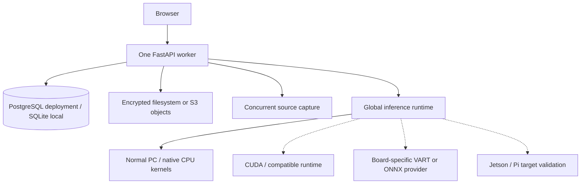

## 13. Database

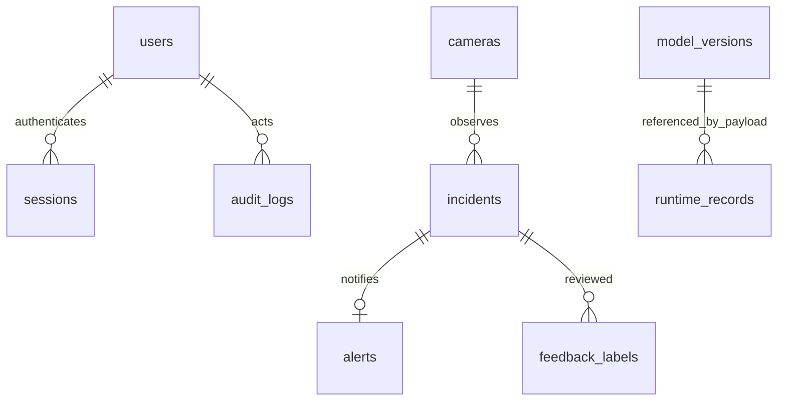

The final relationship is a logical reference in telemetry JSON, not an enforced foreign key. Multi-organization/site normalization and high-volume time-series partitioning are not implemented.
